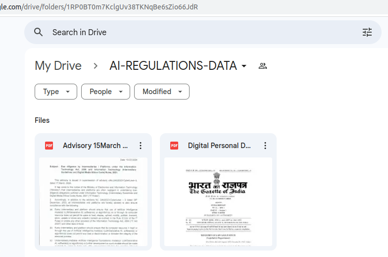
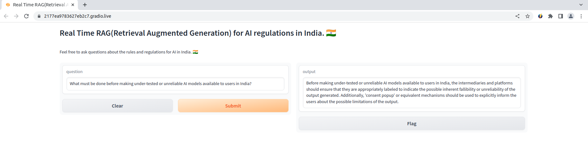
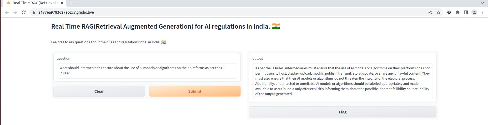
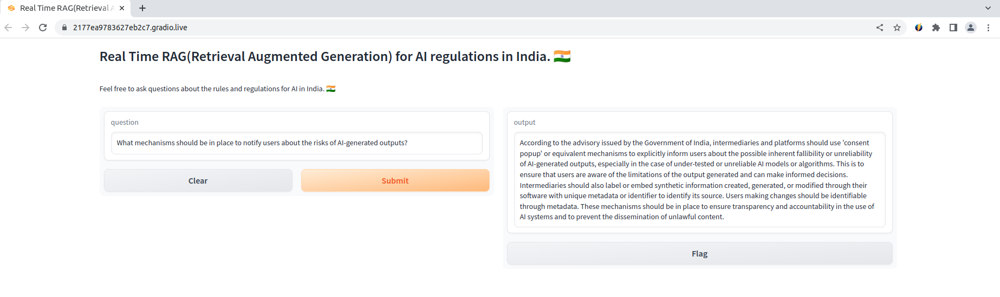

# Build Real-Time Lightning-Fast RAG (Retrieval Augmented Generation) for AI Regulations in India 🇮🇳

This project is built on key technologies including LlamaIndex, Qdrant, Google Drive API, Groq, and OpenAI to create a real-time AI-based chat system for answering questions about AI regulations in India. It combines Google Drive file downloading, PDF to Markdown conversion, document handling, vector-based indexing, and a Gradio-based chat interface for user interaction.

## Major Libraries and Technologies
- **LlamaIndex**: A key library for building vector-based indexing and retrieval, used for creating vector stores and managing context-based chat engines.
- **Qdrant**: A high-performance vector database that enables fast retrieval augmented generation (RAG), allowing the system to manage large-scale document collections efficiently.
- **Google Drive API**: Used for downloading files from Google Drive, facilitating the transfer of data into the pipeline.
- **Groq**: A language model integrated into the chat engine for natural language understanding and response generation.
- **OpenAI**: Utilized in parts of the system for additional language model functionalities.

## Components

### Google Drive File Downloading
The script `google_drive_file_downloads.py` handles downloading files from a specified Google Drive folder to a local directory for further processing.

### PDF to Markdown Conversion
`pdf_to_md.py` converts PDF files into Markdown format for easier handling and storage. After successful conversion, the original PDF files are deleted.

### Qdrant Vector Store Operations
`markdown_to_vector_db.py` loads the converted Markdown files into a Qdrant collection, creating a vector-based index for efficient retrieval augmented generation (RAG).

### Chat Engine and Gradio Interface
- `chat_engine_config.py` defines a context-based chat engine with a memory buffer and the Groq language model.
- `gradio_chat_interface.py` creates a Gradio-based user interface, allowing users to ask questions about AI regulations in India and receive real-time responses.

## Pipeline Overview
The main script, `main.py`, coordinates the entire pipeline:
1. Downloads files from Google Drive.
2. Converts PDF files to Markdown.
3. Loads the Markdown documents into a Qdrant collection.
4. Launches the Gradio-based chat interface for user interaction.

## Environment Variables
To run this project, you need to set environment variables in a `.env` file. Key variables include:
- `GOOGLE_DRIVE_FOLDER_ID`: The ID of the Google Drive folder to download files from.
- `OPENAI_API_KEY`: API key for OpenAI-related functionalities.
- `LLAMAPARSE_API_KEY`: API key for the LlamaParse API.
- `QDRANT_API_KEY`: API key for Qdrant.
- `QDRANT_CLUSTER_URL`: The URL of the Qdrant cluster.
- `QDRANT_COLLECTION_NAME`: The name of the Qdrant collection to use.
- `GROQ_API_KEY`: API key for the Groq language model.

## Create your google service account and save that credentials/key json file into the service account folder

## Installation and Usage
1. **Python Version**: This project requires Python 3.10 or later.
2. **Packages**: Install the required Python packages: from `requirements.txt` file.
3. **Execution**: Run `main.py` to initiate the pipeline and launch the Gradio-based chat interface.

## Additional Information
- The Gradio interface facilitates real-time interaction, allowing users to ask questions about AI regulations in India and receive contextual responses.
- If you encounter issues, ensure the environment variables are correctly set and the required packages are installed.

## Input Google Drive Documents Image

### Fetch the folder ID from the URL and pass into the `google_drive_file_downloads.py` file

## Output Images

## Sources
The data used in this project is based is from the Ministry of Electronics and Information Technology, Government of India:

- [Advisory on AI Regulation](https://www.meity.gov.in/writereaddata/files/Advisory%2015March%202024.pdf)
- [Digital Personal Data Protection Act, 2023](https://www.meity.gov.in/writereaddata/files/Digital%20Personal%20Data%20Protection%20Act%202023.pdf)